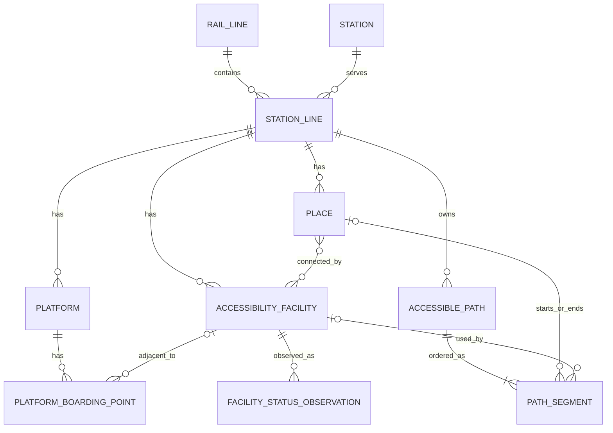

# T06 · 접근성 경로 ERD·방향 모델·원본 매핑

- 확정일: 2026-09-28
- 상태: **완료**
- 연결 기능: F03 여정 조합, F06 권장 승하차 위치, F10 정보 신뢰도와 예외 처리
- 선행 증거: [`T02 공공데이터 검증`](../research/t02-f03-public-data-validation.md),
  [`T03 지원 범위와 G0`](../product/t03-g0-support-scope.md)
- 계약: [`accessibility-domain.ts`](../../packages/contracts/src/accessibility-domain.ts)
- 실제 표본: [`t06-normalized-sample.json`](../../data/verification/t06-normalized-sample.json)

## 모델 경계

이 모델은 데이터베이스 제품을 결정하는 물리 ERD가 아니라 API·앱·향후 저장 계층이
공유하는 논리 모델이다. 원본 코드를 화면 문구에 직접 사용하지 않고, 정규화 엔티티와
출처 근거를 거쳐 여정 후보를 만든다.

- `Station`은 물리적 역, `StationLine`은 한 역이 특정 운영기관·호선에 속한 관계다.
- 승강장과 이전·다음·종착역 방향은 `Platform`에 둔다.
- 출구·대합실·개찰구·승강장 같은 공간은 `Place`로 분리한다.
- 엘리베이터는 여러 `Place`를 연결하는 `AccessibilityFacility`다.
- 차량·문과 이격거리는 `PlatformBoardingPoint`에서 같은 키로 결합한다.
- 진입·퇴장·환승 경로는 `AccessiblePath`와 순서가 있는 `PathSegment`로 보존한다.
- 현재 상태는 시설 자체가 아니라 만료 가능한 `FacilityStatusObservation`으로 쌓는다.
- 구조화할 수 없는 필드와 누락은 버리지 않고 `UnmappedSourceRecord`에 기록한다.

## 논리 ERD



다대다 `Place ↔ AccessibilityFacility` 관계는 계약에서는
`AccessibilityFacility.servedPlaceIds`로 표현한다. 저장소를 도입할 때는 연결 테이블로
분리한다.

## 식별자 규칙

| 엔티티 | 정규화 ID 예시 | 원본 식별 기준 |
| --- | --- | --- |
| RailLine | `line:S1:5` | `railOprIsttCd + lnCd` |
| Station | `station:2543` | 현재 수도권 표본의 정규화 역 코드. 운영기관 간 충돌 시 별도 내부 ID 발급 |
| StationLine | `station-line:S1:5:2543` | 운영기관 + 호선 + 역 코드 |
| Platform | `platform:S1:5:2543:1` | StationLine + `plfNo` |
| Place | `place:2543:exit:2` | 검증된 공간 유형·층·번호 |
| Facility | `facility:2543:internal1` | 검증 연결표의 내부 ID. 서울 이름을 영구 ID로 간주하지 않음 |
| BoardingPoint | `boarding:2543:1:4-4` | Platform + `carOrdr + carEtrcNo` |
| AccessiblePath | `path:2543:entry:1` | StationLine + 경로 유형 + `mvPathMgNo` |
| PathSegment | `segment:2543:entry:1:3` | Path + 원본 단계 순서 |

`mvPathMgNo`는 이동경로 관리번호이며 승강기 시설 ID가 아니다. 서울 API의
`ELVTR_NM`도 안정적인 공통 ID가 아니므로 역·호선·운행 층·설치 위치가 검증된 경우에만
내부 Facility에 연결한다.

## 방향 모델

방향은 상행·하행 문자열 하나로 저장하지 않는다. 노선 분기와 환승을 처리하려면
구조적인 인접 역 조건이 필요하다.

### 승강장 방향

`Platform.direction`은 다음을 함께 가진다.

- `previousStationLineId`: 열차가 현재 역으로 들어오기 직전의 역
- `nextStationLineId`: 현재 역에서 출발한 뒤의 다음 역
- `terminalStationLineId`: API가 반환한 종착역
- `sourceUpDownCode`: 원본 `updnDvCd`; 표시 문구로 직접 해석하지 않음
- `displayLabel`: 종착역 우선 사용자 문구

답십리 1번 승강장은 `next=마장(2542)`, `terminal=방화(2511)`, 2번 승강장은
`next=장한평(2544)`, `terminal=마천(2561)`으로 매핑된다. 분기 구간에서는
`nextStationLineId`와 노선 topology를 먼저 사용하고 종착역을 검증한다.

### 경로 방향

`AccessiblePath.directionCondition`은 진입·퇴장·환승에 공통으로 다음 조건을 둔다.

- `incomingStationLineId`: 현재 역에 들어오는 방향 조건
- `outgoingStationLineId`: 현재 역에서 나가는 방향 조건
- `terminalStationLineId`: 대상 열차 종착역
- `sourcePreviousStationCode`, `sourceNextStationCode`: 원본 요청 조건 보존

`stationMovement`의 `nextStinCd`는 출발선의 진행 방향으로 사용한다. 환승 API의 이전·다음
역 코드는 환승 대상선의 양쪽 인접 역 조건으로 저장한다. 도착역 퇴장은 진입 경로를
역순으로 사용하는 파생 경로이므로 `type=exit`로 별도 생성하고 같은 원본 evidence와
`manual_verification` 근거를 남긴다.

## API 원본 매핑

| 원본 API | 주요 필드 | 정규화 대상 | 보존·제한 |
| --- | --- | --- | --- |
| `subwayRouteInfo` | 운영기관·호선·역 코드, 순서, 역명 | RailLine, Station, StationLine | 역명 별칭과 코드 충돌은 수동 보정 분리 |
| `stPlf` | `plfNo`, `updnDvCd`, `runDirTmnStinCd`, 층 | Platform, PlatformDirection | 상·하행 코드는 표시 문구로 직접 쓰지 않음 |
| `stationMovement` | `mvPathMgNo`, `exitMvTpOrdr`, `mvContDtl`, 시작·도착 문구 | AccessiblePath, PathSegment | 자연어로 Place 경계를 확정할 수 없으면 `partial` |
| `transferMovement` | 경로 관리번호·순서, 대상선 인접 역 조건 | transfer Path, PathSegment, directionCondition | 환승 대상선 방향 조건으로 해석 |
| `stinElevatorMovement` | 경로 구분·관리번호·순서·상세 문장 | PathSegment 보강 | 출입구·환승 경로가 섞여 있어 관리번호별 분리 필요 |
| `stationElevatorCarNumber` | `plfNo`, 차량·문 | PlatformBoardingPoint | 방향은 Platform과 결합해야 함 |
| `stationPlatformTrainDistance` | `plfNo`, 차량·문, `sfDst` | PlatformBoardingPoint.gapDistanceCm | 차량·문 키가 없는 레코드는 연결하지 않음 |
| `stationElevator` | 출구·층·상세 위치 | Facility와 Place 후보 | 현재 상태가 아닌 정적 시설 정보 |
| `SeoulMetroFaciInfo` | 역 코드, 시설명, 운행구간, 설치위치, `USE_YN` | FacilityStatusObservation | 공통 시설 ID와 행별 `observedAt` 없음 |

모든 정규화 엔티티는 `SourceEvidence[]`를 가질 수 있다. `collectedAt`은 Elbero가 응답을
수집한 시각이고 `observedAt`은 제공기관이 상태를 관측한 시각이다. 서울 승강기 응답에는
후자가 없으므로 `observedAt=null`을 유지한다. 두 시각을 서로 대신 사용하지 않는다.

## 실제 답십리 표본 대조

`data/research/t02/raw/2026-09-18T01-29-34.781Z`의 원본과 서울 상태 표본을
`t06-normalized-sample.json`에 매핑했다.

| 확인 항목 | 실제 응답 | 모델 결과 |
| --- | --- | --- |
| 역·호선 | `S1 / 5 / 2543 / 답십리` | Line 1건, Station 1건, StationLine 1건 |
| 승강장 | 1·2번, B3, 종착 2511·2561 | Platform 2건과 구조적 방향 조건 |
| 권장 차량·문 | 1번 `4-4`, 2번 `5-1` | BoardingPoint 2건 |
| 이격거리 | 두 권장 문 모두 `sfDst=9` | `gapDistanceCm=9`, 추천 가능 |
| 서울 시설 | 내부 2대, 외부 2대 | Facility 4건과 Place 연결 |
| 상태 | 네 시설 모두 `사용가능` | operational Observation 4건 |
| 진입 경로 | 2번 출구→마장 방면, 관리번호 1, 6단계 | Path 1건, Segment 6건 |
| 미확정 | 상태 코드 null, 공통 시설 ID·관측 시각 없음, 일부 자연어 경계 | UnmappedSourceRecord 3건 |

검증 명령은 다음과 같다.

```bash
npm run verification:t06
```

검증기는 엔티티별 ID 중복, StationLine·Platform·Place·Facility·Path 참조, 방향 참조,
경로 단계 연속성, 관측·수집 시각 분리, 미매핑 기록 존재를 검사한다.

## 현재 구현과의 대응

| 현재 코드 | 논리 모델 |
| --- | --- |
| `LINE_5_GUIDANCE.stations` | Station + StationLine + Platform 요약 |
| `liveElevators` | AccessibilityFacility |
| `directions[].recommendedDoors/doorGaps` | PlatformBoardingPoint |
| `VerifiedJourneyDefinition` | 정규화 데이터를 읽어 만든 여정 후보 read model |
| `VerifiedFacilityRef` | PathSegment가 요구하는 Facility 참조 |
| `SeoulElevatorStatusSnapshot` | FacilityStatusObservation 생성 전 원본 snapshot |

현재 생성 파일을 즉시 데이터베이스 형태로 재작성하지 않는다. T10에서 이 논리 계약을
입력·검사 스키마로 만들고, 기존 5호선 생성기를 단계적으로 정규화 패키지 출력으로
전환한다.

## 구조화하지 않는 정보와 누락 정책

- 자연어만으로 시작·도착 Place를 확정할 수 없는 단계는 `partial`로 보존한다.
- 시설 공통 ID가 없으면 이름이 비슷하다는 이유만으로 연결하지 않는다.
- KRIC의 `elvtSttCd`가 null이거나 코드 의미가 검증되지 않았으면 상태로 사용하지 않는다.
- 서울 상태의 행별 관측 시각이 없으면 `observedAt=null`, 수집 시각은 `collectedAt`에 둔다.
- 차량·문 레코드가 이격거리 데이터에 없으면 BoardingPoint를 추천하지 않는다.
- API 간 값이 다르면 한쪽을 삭제하지 않고 evidence의 `conflict`와 별도 수동 보정으로 남긴다.

## 남은 제한과 다음 작업

- T07: 이 모델을 기준으로 모듈 입력·출력 계약, 오류 코드, 저장·복구 경계를 설계한다.
- T10: JSON Schema 또는 런타임 validator, 정규화 도구와 데이터 패키지 생성기를 구현한다.
- T11: incoming/outgoing/terminal 조건으로 방향·환승·고장 제외 경로를 계산한다.
- T16: `unverified`, `conflict`, 만료 상태를 사용자 상태로 변환한다.
- 현 표본은 답십리 중심이며 1~9호선 전체 데이터 마이그레이션은 T10 이후 수행한다.

실제 표본 대응, 검증 증거, 구조화할 수 없는 원문과 누락, 후속 작업을 모두 기록했으므로
T06의 설계 완료 기준으로 사용한다.
