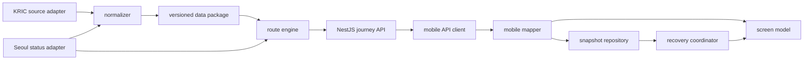
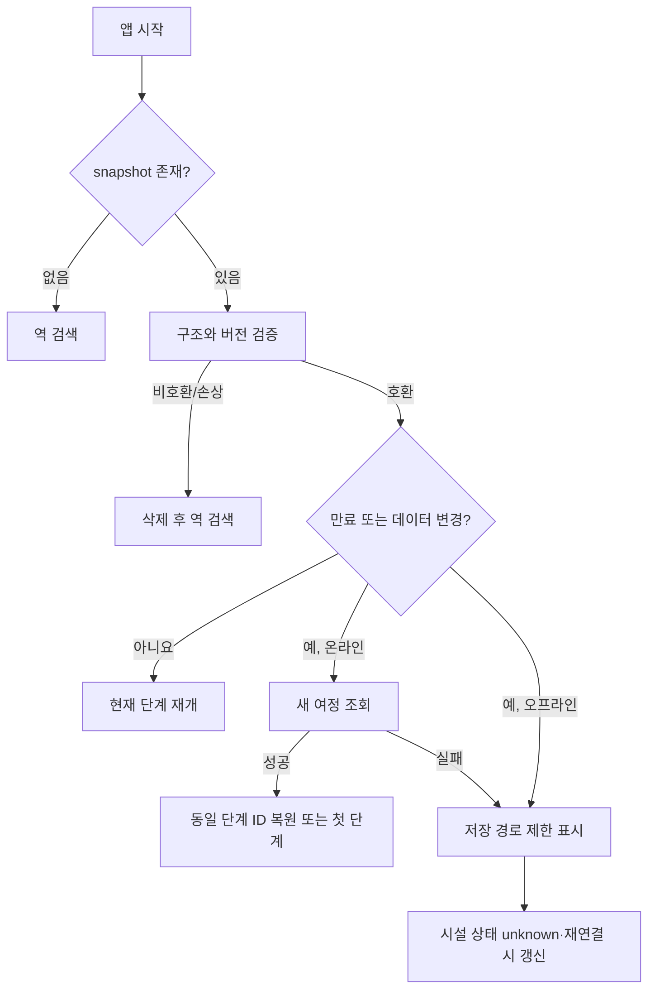

# T07 · 모듈 계약·오류 코드·저장 복구 설계

- 확정일: 2026-09-28
- 상태: **완료**
- 연결 기능: F03 여정 조합, F13 현재 여정 보관
- 선행 설계: [`T06 접근성 경로 데이터 모델`](./t06-accessibility-data-model.md)
- 공유 계약: [`journey-runtime.ts`](../../packages/contracts/src/journey-runtime.ts)
- 복구 표본: [`t07-recovery-scenarios.json`](../../data/verification/t07-recovery-scenarios.json)

## 1. 결정 요약

- 공공데이터 원본 해석, 정규화, 경로 계산, HTTP 표현, 앱 화면 표시를 분리한다.
- 모든 작업 결과는 성공과 실패를 구분하는 `JourneyContractResult<T>` 형태로 표현한다.
- 데이터 부족과 승강기 상태 미확인은 시스템 장애나 빈 결과로 바꾸지 않는다.
- 현재 여정은 전체 데이터셋이 아니라 화면 복구에 필요한 선택 경로와 현재 단계만 저장한다.
- 저장본이 오래됐어도 오프라인에서는 일반 이동 설명과 현재 단계를 복구할 수 있다. 단, 저장된
  승강기 상태는 신뢰하지 않고 `unknown`으로 표시한다.
- snapshot 스키마나 계약의 major 버전이 호환되지 않으면 자동 복구하지 않는다.

## 2. 모듈 경계와 의존 방향



| 모듈 | 입력 | 출력 | 책임 | 하지 않는 일 |
| --- | --- | --- | --- | --- |
| `source-adapters` | 인증·요청 조건 | 원본 batch와 수집 메타데이터 | timeout, 원본 오류 보존, 수집 시각 | 출구·방향 추정, 사용자 문구 생성 |
| `normalizer` | 원본 batch | T06 `AccessibilityDataPackage` | 코드 정규화, evidence와 누락 기록 | 경로 추천, 실시간 상태 판단 |
| `data-package` | 정규화 결과 | 불변 `dataVersion` 패키지 | 원자적 교체, 현재/이전 버전 제공 | 요청 중 부분 덮어쓰기 |
| `route-engine` | 정규화 패키지, 상태 관측, 여정 요청 | 후보 경로와 warning/error | 방향 조합, red 제외, 시설 상태 반영 | HTTP 상태 결정, 화면 문구 스타일링 |
| NestJS `journey` | 요청 DTO, route-engine 결과 | OpenAPI HTTP 응답 | 입력 검증, 오류→HTTP 매핑, request ID | KRIC 원본 노출, 앱 로컬 복구 |
| mobile `api` | 역 코드 | 생성된 HTTP DTO | timeout/취소, 응답 envelope 해석 | 화면 모델 생성, 오류 숨김 |
| mobile `mapper` | HTTP DTO | 앱 `JourneyPlan` | 앱 모델 변환, unsupported/incomplete 분리 | 네트워크 요청, 저장 I/O |
| `snapshot-repository` | `JourneySnapshot` | 검증된 snapshot 또는 storage 오류 | 단일 key 원자적 저장·읽기·삭제 | 서버 데이터 갱신, 추천 재계산 |
| `recovery-coordinator` | snapshot, 연결 상태, 현재 버전 | `JourneyRecoveryDecision` | 재개·새로고침·제한 복구 결정 | 오래된 상태를 현재 상태로 표시 |

의존성은 어댑터에서 정규화·경로 엔진·전달 계층 쪽으로만 흐른다. `route-engine`은 NestJS와
React Native를 import하지 않는다. 모바일 저장소도 API DTO가 아니라 mapper 이후 snapshot만
저장한다.

## 3. 성공·실패 계약

`JourneyContractResult<T>`는 다음 두 형태만 허용한다.

```ts
type Result<T> =
  | { ok: true; data: T; warnings: JourneyContractError[]; meta: Meta }
  | { ok: false; error: JourneyContractError; meta: Meta };
```

- 성공이어도 `DATA_MISSING`, `DATA_CONFLICT`, `FACILITY_STATUS_UNKNOWN`을 warning으로 포함할 수
  있다. 일반 지하철 경로는 표시하되 확인되지 않은 안전 정보만 제한한다.
- 실패는 화면에서 표시할 수 있는 안전한 `message`만 포함한다. 원본 URL, 서비스 키, 원본 응답
  전체와 stack trace는 서버 로그에만 남긴다.
- `meta.contractVersion`은 API 구조 버전, `meta.dataVersion`은 정규화 데이터 패키지 버전이다.
  두 버전은 서로 대신하지 않는다.
- 모든 서버 응답은 `requestId`를 포함해 앱 제보와 서버 로그를 연결할 수 있게 한다.

## 4. 오류 코드와 처리

| 코드 | 의미 | HTTP | 재시도 | 앱 처리 |
| --- | --- | ---: | --- | --- |
| `INVALID_REQUEST` | 역 코드·요청 형식 오류 | 400 | 아니요 | 입력 수정 |
| `UNSUPPORTED_JOURNEY` | 현재 지원 범위 밖 | 422 | 아니요 | 지원 밖 화면 |
| `SOURCE_UNAVAILABLE` | 외부 제공기관 장애 | 503 | 예 | 재시도, 저장본 제안 |
| `SOURCE_TIMEOUT` | 외부 제공기관 timeout | 503 | 예 | 재시도, 저장본 제안 |
| `DATA_MISSING` | 필수 위치·연결 정보 누락 | 422 | 아니요 | 일반 경로+안전 정보 미확인 |
| `DATA_CONFLICT` | 출처 간 필수 정보 충돌 | 409 | 아니요 | 일반 경로+현장 확인 안내 |
| `FACILITY_STATUS_UNKNOWN` | 현재 가동 상태 미확인 | 503 | 예 | 상태 미확인, 안전 추천 중지 |
| `NO_ACCESSIBLE_ROUTE` | 모든 후보가 고장·red로 제외 | 422 | 아니요 | 안전 경로 없음 |
| `DATA_VERSION_UNSUPPORTED` | API·데이터 버전 조합 불가 | 409 | 예 | 데이터 새로고침 |
| `SNAPSHOT_CORRUPTED` | 저장본 검증 실패 | 409 | 아니요 | 저장본 삭제 후 새 조회 |
| `SNAPSHOT_EXPIRED` | 저장본 상태 유효시간 만료 | 409 | 예 | 온라인 새로고침, 오프라인 제한 복구 |

현재 `JourneyService`의 `UNSUPPORTED_JOURNEY` 문자열은 이 공용 코드를 그대로 사용하도록 T11에서
전환한다. Nest의 기본 validation 오류도 T10 이후 전역 exception filter에서
`INVALID_REQUEST` envelope로 변환한다.

## 5. Journey snapshot 계약

`JourneySnapshot`은 하나의 활성 여정만 `elbero.active-journey.v1` key에 저장한다. 초기 버전은
작은 JSON 한 건이므로 AsyncStorage를 사용하고, 여러 여정 이력이나 관계 검색이 필요해질 때만
SQLite로 옮긴다.

필수 저장 항목은 다음과 같다.

- `snapshotSchemaVersion`, `contractVersion`: 읽을 수 있는 구조인지 판정
- `snapshotId`, `savedAt`, `expiresAt`: 중복 쓰기와 신선도 판정
- 출발·도착 코드, `journeyId`, 선택 경로 ID: 온라인 재조회
- `currentStepOrder`: 앱 종료 직전 단계 복구
- `dataVersion`, `statusCheckedAt`: 경로 데이터와 실시간 상태의 신선도 판정
- 선택 경로의 역명·안내 단계: 오프라인 제한 복구

저장 원칙:

1. 여정 조회와 mapper가 성공한 뒤 저장한다.
2. 다음/이전 단계 이동 시 `currentStepOrder`만 포함한 전체 snapshot을 원자적으로 교체한다.
3. `expiresAt`은 상태 응답의 최대 지연 한도를 넘기지 않는다. 현재 서울 API 기준 최대 60분이다.
4. 여정 완료·사용자 취소·로그아웃 시 삭제한다.
5. 쓰기 실패는 현재 화면 진행을 막지 않지만 복구 불가 안내용 오류로 기록한다.
6. 서비스 키, 원본 API 응답, 사용자의 자유 입력은 저장하지 않는다.

## 6. 복구 결정표

| 조건 | 온라인 | 결정 | 저장 경로 | 저장 시설 상태 |
| --- | --- | --- | --- | --- |
| schema/contract 호환, 미만료, dataVersion 동일 | 무관 | `resume_fresh` | 표시 | 신뢰 가능 |
| 만료 또는 dataVersion 변경 | 예 | `refresh_then_resume` | 갱신 중 임시 표시 | 신뢰 불가 |
| 만료, 오프라인 | 아니요 | `resume_offline_limited` | 표시 | `unknown`으로 대체 |
| snapshot schema 불일치 | 무관 | `discard` | 표시 안 함 | 신뢰 불가 |
| contract major 불일치 | 무관 | `discard` | 표시 안 함 | 신뢰 불가 |
| JSON·필수 필드 검증 실패 | 무관 | `discard` | 표시 안 함 | 신뢰 불가 |

`resume_offline_limited`에서는 출발·도착, 선택 경로, 현재 단계와 일반 이동 설명만 복구한다.
“현재 운행 중”, “안전 경로” 같은 실시간 판단은 표시하지 않고 “오프라인 · 승강기 상태 미확인”을
한 카드로 표시한다. 연결이 회복되면 같은 역 코드로 새 여정을 조회하고, 동일 route/step ID가
있으면 현재 단계를 유지한다. 없으면 첫 단계에서 다시 시작한다.

## 7. 버전 규칙

- `contractVersion`: `major.minor`. major가 같으면 읽을 수 있고, minor 추가 필드는 무시한다.
- `snapshotSchemaVersion`: 정수. 정확히 같을 때만 자동 복구한다.
- `dataVersion`: 생성된 데이터 패키지의 불변 ID. 다르면 온라인 재계산이 필요하다.
- 앱 배포 버전은 위 세 버전과 별개다.
- 새 버전 배포는 현재와 직전 데이터 패키지를 함께 보관한 뒤 원자적으로 current 포인터를 바꾼다.
- 정규화 실패 시 마지막 검증 버전을 유지하며 부분 생성물을 current로 승격하지 않는다.

## 8. 실패·복구 흐름



## 9. 검증 증거

```bash
npm run verification:t07
```

검증기는 공용 계약을 빌드한 뒤 필수 오류 정책 11개와 다음 7개 복구 시나리오를 실제 결정 함수로
확인한다.

- 온라인·미만료
- 온라인·만료
- 오프라인·만료
- 온라인·dataVersion 변경
- snapshot schema 불일치
- contract major 불일치
- 저장본 손상

## 10. 남은 제한과 다음 작업

- T10: source adapter·normalizer 결과에 런타임 스키마와 실제 오류 envelope를 적용한다.
- T11: route-engine이 공용 오류/warning과 데이터 버전을 반환하도록 전환한다.
- T16: 오류 코드별 단일 사용자 카드와 접근성 문구를 구현한다.
- T17: AsyncStorage repository, 앱 시작 복구 coordinator, 단계 변경 저장을 구현한다.
- 저장 데이터 암호화는 현재 비민감 여정 정보만 저장하므로 적용하지 않는다. 위치 이력·계정이
  추가되면 별도 보안 검토를 수행한다.
